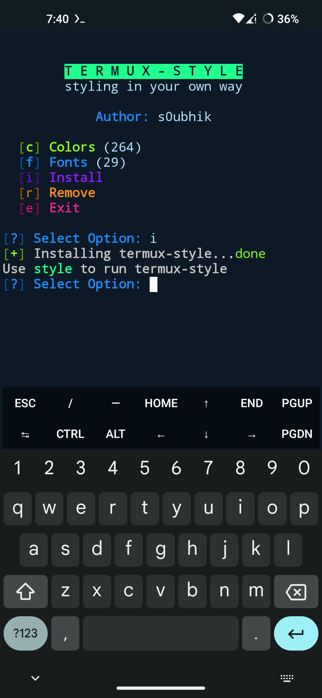
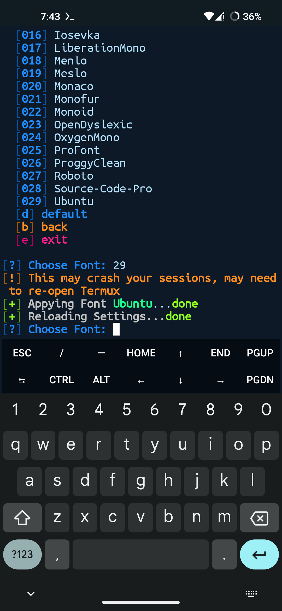

#termux-style
styling in your own way

this tool lets you to install more than 250+ color shemes and 26 best fonts in your termux.

##Installation
These steps will install termux-style in your termux.
```
# clone the repo
git clone https://github.com/blackc8/termux-style.git
# get into the directory
cd termux-style
# install termux-style
./style --install
# launch termux-style
style
```

## Screenshots
### home menu

### installing termux-style

### removing termux-style

### changing color

### changing font


## Contributer
*  **Initial work** - [blackc8](https://github.com/termux-lock)

##  License & copyright
© 2020 blackc8 <blackc8official@gmail.com>

Licensed under the [MIT LICENSE](LICENSE)
